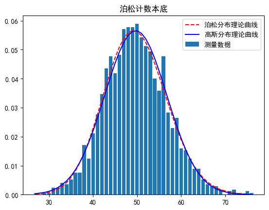
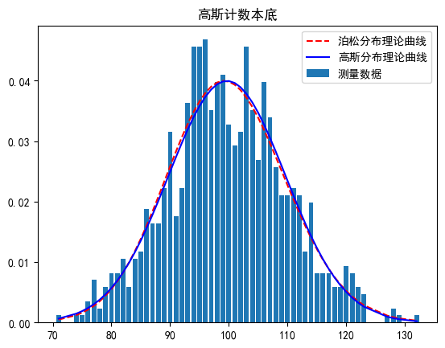

---
# 指定汉字字体，如果缺少中文显示将不正常
CJKmainfont: 方正苏新诗柳楷简体-yolan

# pandoc设置
output:
   word_document
   # path: 你想保存的路径，默认与.md文档同文件
# 打印背景色
# 保存文件时自动生成
# export_on_save:
#   pandoc: true
---
# 实验报告
实验名称：放性测射量的统计误差
实验人员：朱天宇 
班级：物理2201
学号：202211010110
## 实验原理简述
放射性原子核衰变的统计分布可以根据数理统计分布的理论来推导。放射性原子核衰变的过程是一个相互独立彼此无关的过程，即每一个原子核的衰变是完全独立的，和别的原子核是否衰变没有关系，而且哪一个原子核先衰变，哪一个原子核后衰变也纯属偶然的，并无一定的次序，因此放射性原子核的衰变可以看成是一种伯努里试验问题。  

考虑到实验中参与衰变粒子数量非常大（$>10^{23}$），以及实验测量时间与粒子寿命的情况（$\lambda t<<1$），衰变粒子的数量可以由二项分布近似为泊松分布、正态分布。  
泊松分布满足
$W(N)=\frac{\bar N^N}{N!}e^{-N}$
正态分布满足
$W(N)=\frac{1}{\sqrt{2\pi}\sigma}e^{-\frac{(N-\bar N)^2}{2\sigma^2}}$
式子中$\sigma^2=\bar N$ , $W(N)$ 是在 N 处的概率密度值.

当我们用探测器记录衰变粒子引起的脉冲数时，这个脉冲数与衰变原子核数是成正比的。通过观察大量的单个衰变事件，就可以得到在给定时间间隔内可能发生的衰变数。假设在时间间隔 t 内核衰变的平均数为$\bar N$ ,则在此时间间隔$t$内衰变数为$N$的出现几率为$W (N)$ 。当$\bar N$较大（一般大于20）时，在同一测量装置上对同一放射源进行多次测量，在坐标纸上画出每一次测量值出现的几率，就可以得到高斯分布曲线.

## 实验数据列表
见附件 "朱天宇202211010110.csv"

## 实验结果分析和数据处理

### 1.泊松分布本底（计数次数=1698次）

单次计数时长$t=1 $ s
计算可得
$\bar N=49.70$
$\sigma=\sqrt{\bar N}=7.05$

### 2.高斯分布本底（计数次数=854次）

单次计数时长$t=2 $ s
计算可得
$\bar N=99.68$
$\sigma=\sqrt{\bar N}=9.98$

### 3.算术平均值的统计误差

**泊松本底的**

$ \bar N \pm \sqrt{\frac{\bar N}{m}}=49.70\pm 0.17  $

**高斯本底的**

$ \bar N \pm \sqrt{\frac{\bar N}{m}}=99.68\pm 0.34  $

### 4.一次测量的统计误差

**泊松本底的**

$\bar N \pm \sqrt{\bar N}=49.70\pm 7.05 $

**高斯本底的**

$\bar N \pm \sqrt{\frac{\bar N}{m}}=99.68\pm 9.98  $

### 5.数据在$3\sigma$范围内的频率

**泊松本底的**
$ f(\bar N\pm\sigma)=0.687326 $
$ f(\bar N\pm2\sigma)=0.945875 $
$f(\bar N\pm3\sigma)=0.991895  $
**高斯本底的**
$f(\bar N\pm\sigma)=0.680738$
$f(\bar N\pm2\sigma)=0.941171$
$f(\bar N\pm3\sigma)=0.998451$

### 6.$\chi^2$检验

取$\alpha=0.05$，计算每个本底分布的$\chi^2$值与$\chi^2_{0.05}$对比
**对计数次数为1698次的泊松本底**，单次计数最高为76，最低为27，将其分为9组.列出表格如下

|组限|组中值$H_j$|频数$f_j$|标准化后的组限$(N-\bar N)/\sigma$|理论频率$nP_j$|$\frac{(f_j-nP_j)^2}{nP_j}$|
|:---|:---|:---|:---|:---|:---|
|26.5~31.5|29|7|$-\infty$~-2.582|7.47|0.0296|
|31.5~36.5|34|39|-2.582~-1.872|43.57|0.4793|
|36.5~41.5|39|146|-1.872~-1.163|155.89|0.6274|
|41.5~46.5|44|367|-1.163~-0.454|343.95|1.5447|
|46.5~51.5|49|485|-0.454~0.255|468.33|0.5934|
|51.5~56.5|54|381|0.255~0.965|393.68|0.4084|
|56.5~61.5|59|185|0.965~1.674|204.27|1.8179|
|61.5~66.5|64|66|1.674~2.383|65.38|0.0059|
|66.5~76.5|71.5|22|2.383~$+\infty$|14.58|3.7761|
|$\Sigma$||1698|||9.28|

显然，$\chi^2=\Sigma\frac{(f_j-nP_j)^2}{nP_j}$=9.28<$\chi^2_{0.05}(9-2-1)=12.592$,故可以认为数据分布符合正态分布。
**对计数次数为855次的高斯本底**，单次计数最大为132，最小为71，将其分为9组，列出表格如下

|组限|组中值$H_j$|频数$f_j$|标准化后的组限$(N-\bar N)/\sigma$|理论频率$nP_j$|$\frac{(f_j-nP_j)^2}{nP_j}$|
|:---|:---|:---|:---|:---|:---|
|70~77|73.5|6|$-\infty$~-2.273|9.84|1.4985|
|77~84|80.5|35|-2.273~-1.571|39.80|0.5789|
|84~91|87.5|100|-1.571~-0.870|114.70|1.8840|
|91~98|94.5|198|-0.870~-0.168|206.00|0.3107|
|98~105|101.5|184|-0.168~0.533|230.72|9.4606|
|105~112|108.5|140|0.533~1.234|161.15|2.7758|
|112~119|115.5|53|1.234~1.936|70.17|4.2014|
|119~126|122.5|24|1.936~2.637|19.03|1.2980|
|126~133|129.5|5|2.637~$+\infty$|3.58|0.5632|
|$\Sigma$||855|||22.57|

## 思考题

1.放射性原子核衰变的统计性是指放射性衰变是一种随机现象，无法预测单个原子核何时会衰变，但可以通过统计规律描述大量原子核的衰变行为。放射性衰变遵循指数衰减规律，即放射性核素的数量随时间呈指数下降。实验中，把测量数据绘制为频率分布图、计算平均值、方差等统计量与理论值做对比，结果和那个分布更接近，就认为满足那个分布。
2.$\sigma$的意义是标准差，表示单次测量值偏离平均值的范围。当单次测量时间小于半衰期时，可以用$N\pm\sqrt{N}$表示放射性测量值，它的物理意义表示在完全相同的条件下再进行一次测量，其测量值处于 $N-\sqrt{N}$到 $N+\sqrt{N}$范围内的几率为 68.3%。
3.当$n_b=50,n_s=150,\delta=0.01$,样品本底测量时间为
$t_s=\frac{n_s+\sqrt{n_sn_b}}{(n_s-n_b)^2\delta^2}=236.60$ (分钟)
$t_b=\frac{n_b+\sqrt{n_sn_b}}{(n_s-n_b)^2\delta^2}=136.60$ (分钟)
4.不考虑本底影响，取$n_b=0$,则
$\delta=\sqrt{\frac{1}{t_sn_s}}=\frac{\sqrt{N}}{N}$