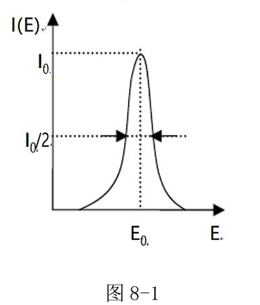
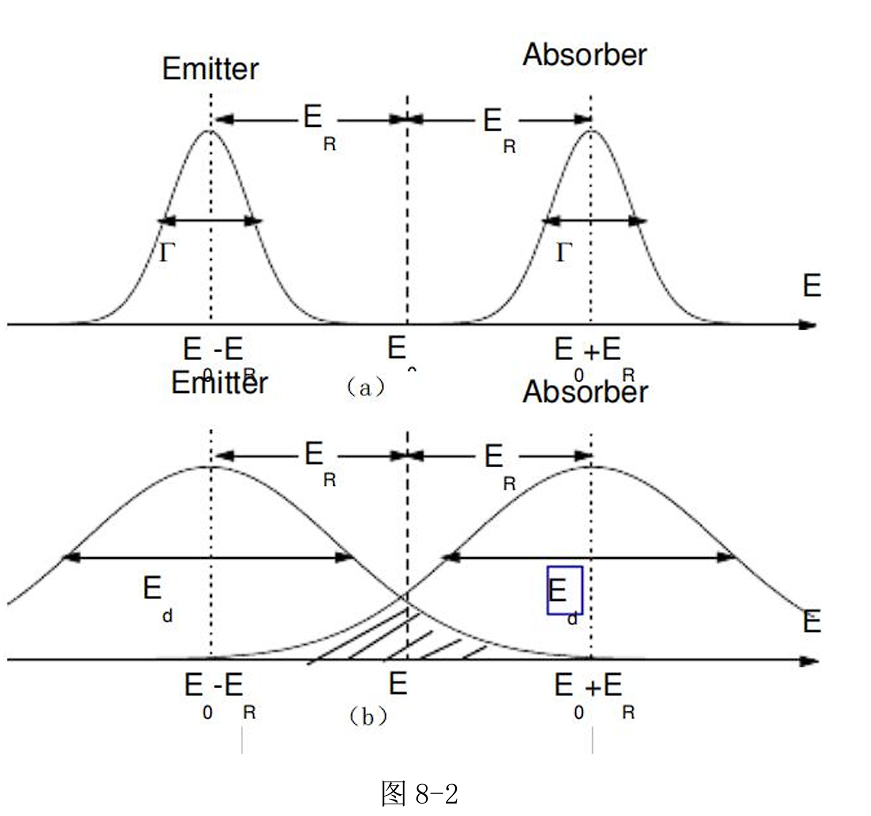
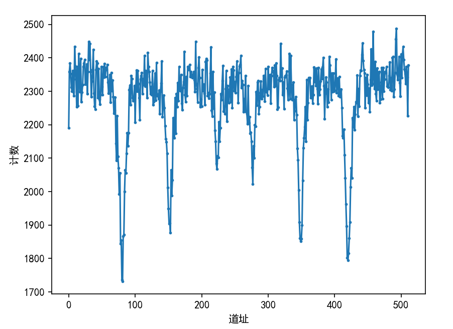

实验名称：穆斯堡尔效应实验

实验人员：朱天宇

学号：202211010110
## 实验目的
1．学习并掌握穆斯堡尔效应的原理；
2．了解、熟悉穆斯堡尔谱仪的结构和工作原理；
3．了解并掌握通过测量穆斯堡尔谱获取物质超精细参数的方法。

## 实验原理

1．γ射线的产生与谱线的自然线宽

γ射线是波长极短的电磁波。和原子类似，原子核也可以处与不同的能量状态，即我们常说的能级。当不稳定的原子核从具有较高能量的激发态能级跃迁到较低能级（例如基态）时，就会放射出γ射线。反之，如果原子核可以吸收具有某一个特定能量的γ射线，则可以从一个较低的能量状态跃迁回到一个较高能量状态。
由于原子核的激发态存在有限长的寿命τ，则它跃迁后发射的γ射线能量不是唯一值，表现为能量谱线具有洛伦兹分布，而且对应的能量谱线具有一定宽度。已知光子的能量谱线强度和光子频率ω之间的关系是
$I(\omega)\propto\frac{1}{(\omega-\omega_0)^2+(\frac{1}{2\tau})^2}$
考虑到光子的能量$E=\hbar\nu$($\hbar$为约化普朗克常
数)，得到谱线强度按照能量的分布：
$I(E)\propto\frac{1}{(\omega-\omega_0)^2+(\frac{1}{2\tau})^2}$
当$E-E0=\pm h/2\tau$时，可以计算出谱线的强度下降为最大值的一半。这时我们可以将对应的谱线半高宽称为γ射线的自然线宽Γ。而且根据海森堡的测不准关系易知τ和Γ满足：
$\Gamma\sim\frac{h}{\tau}$

图8-1为典型的洛伦兹型吸收谱线，线宽为$\Gamma$。而对于发射谱线和吸收谱线均具有类似上式的能量分布
$I(E)\propto\frac{1}{(E-E_0)^2+(\frac{\Gamma}{2})^2}$

2．原子核对γ射线的有反冲共振吸收现象：

正如前面所述，原子核中由高到低的能级跃迁可以放出γ射线，反之如果能够吸收合适能量的γ射线，也可以从低能级跃迁到高能级。这种不同能量状态之间的跃迁就是我们熟悉的γ辐射和γ吸收现象。考虑到原子核的质量比较小，而放射或者吸收的γ射线的能量又比较大（通常在keV到MeV量级），因此在放射和吸收过程中必须要考虑到原子核的反冲现象对放射和吸收谱线的影响。假设原子核的质量为m，初速度为零，激发态$E_e$和基态$E_g$的能级差为$E_0=E_e-E_g$，辐
射γ射线时为了保证动量守恒，原子核的反冲动量$mu_R$应该等于发射γ射线的动
量$P_y$，即$mu_{_R}=P_{_y}=E_{_y}/c$。根据能量守恒定律: $E_0=E_y+E_R$，可得原子核的反冲动能$\mathrm{E_{R}=\frac{mu_{R}^{2}}{2}=\frac{P_{\gamma}^{2}}{2m}=\frac{E_{\gamma}^{2}}{2mc^{2}}}$，因此原子核反冲会导致实际发射的γ射线能量为
$\mathrm{E_{R}=\frac{mu_{R}^{2}}{2}=\frac{P_{\gamma}^{2}}{2m}=\frac{E_{\gamma}^{2}}{2mc^{2}}}$，小于能级差$E_0$，而消耗的能量在原子核的反冲动能$E_R$上。反正在原子核的共振吸收时也会碰到同样的现象：如果需要从基态跃迁到激发态，γ射线所需要提供的能量为$(E_{e}-E_{g})+E_{R}$，多出的能量使共振原子核有一个反冲能$E_R$。
因此发射谱和吸收谱就会产生$2E_R$的偏移，如图8-2(a)所示。这个反冲能能量$E_R$与原子核的质量和γ射线的能量有关，在某些特定情况下比自然线宽$\Gamma$大得多，以我们实验中用的57-Fe原子核为例，$E_0=14.41keV$,则$ E_R≈2×10^{-3}eV$,而对应的自然线宽为$10^{-8}$eV量级，因此造成吸收谱和发射谱之间的重叠很少，应该看不到共振吸收现象。在上面的讨论中，我们假设原子是孤立的、自由的和静止的。实际情况是原子核有热运动，因此也会由热运动提供一定的多普勒能量，使发射谱和吸收谱有很大展宽，而不等于自然线宽，这种谱线的增宽称为多普勒增宽，展宽后的谱线宽度为$E_{d}=2\sqrt{E_{K}E_{R}}$，其中$E_K=\frac{K_BT}{2}$为一个原子核每个自由度平均动能。图8-2(b)中的$E_d$大约在 $10^{-2}$eV的量级，这样会使吸收和发射谱线可能会有一定的重叠。所以原则上讲，可以通过提高测量温度是原子核热运动加快，产生较多的谱线重叠，以获得有反冲的原子核对γ射线的共振吸收。在发现穆斯堡尔效应之前，通常使用的办法主要就是采用加热和加速的办法补偿反冲时的能量损失，而且由于总的重叠面积较小，要想观察这种原子核的有反冲共振吸收总是比较困难。

 3．原子核对γ射线的无反冲共振吸收现象(穆斯堡尔效应)：

前面考虑的均为有反冲共振吸收现象，那么如果有一种办法可以使原子核被牢牢固定，应该可以减小反冲能 $E_d$，甚至使之趋向于零，这样发射谱线和吸收谱线的叠加将明显增加，共振效应也易观察到。具体讲来，如果把发射核和吸收核均牢牢地固定在固体晶格中，当发射或吸收γ射线时，需要考虑的反冲能$E_R=\frac{\mathrm{E}^{2}}{2\mathrm{Mc}^{2}}$其中M为晶体的质量,远远大于单个原子核的质量m,因此反冲能急剧减小，甚至可以看为0。这样发射谱线和吸收谱线可以认为完全重合，可以获得非常大的重合面积，很容易发生共振吸收现象。但是实际上的过程比前面所说的要复杂的多，因为晶格的振动是一种量子化的体系，根据爱因斯坦模型如果提供 $\hbar\omega,2\hbar\omega,3\hbar\omega$ 等能量就可以改变晶格的振动状态，即激发出声子，声子的频率为$\omega$。如果在这个过程中不产生或者吸收声子，那么发射和吸收γ射线的能量就不会改变，因此原子核不会产生反冲能量损耗。这种没有反冲能量损耗的γ射线发射或者吸收过程的概率就被称为无反冲分数f。实际上爱因斯坦模型过于简单，更接近实际的是晶格振动的德拜模型，但仍然可以获得类似结果。所以一句话来说，穆斯堡尔效应就是原子核对γ射线的零声子无反冲共振和吸收效应。
在晶格振动的爱因斯坦模型下，可计算出固体中有关和产生穆斯堡尔效应的几率即无反冲分数$f=\exp[-E_y^2<x^2>/(hc)^2]$，实际是固体中的穆斯堡尔核在发射或吸收γ光子时不激发或吸收声子（零声子）过程的几率，又被称为穆斯堡尔分数。其中 $<x^{2}>$为穆斯堡尔原子在γ射线传播方向上的均方振幅。要易于观察到穆斯堡尔效应，f 必须尽可能的大，这就要求γ光子的能量不能太高（低能的γ辐射）,穆斯堡尔原子与基质原子间的束缚要强,实验温度不能太高（这点恰好和原子核的有反冲共振吸收的实验现象相反，也正是穆斯堡尔发现这个效应的根源）。此式表明：在液体、气体中，因$<x^{2}>$很大，以至难以观察到穆斯堡尔效应。当然并不是发射核或吸收核只要存在于固体之中就必定发生穆斯堡尔效应，但只有在固体之中的核才有可能产生穆斯堡尔效应。凡有穆斯堡尔效应的原子核,我们称之为穆斯堡尔核。
例如,在室温下57-Fe的无反冲分数可高达0.7-0.8。此外119-Sn的23.87 keV的γ跃迁在室温下有较大的无反冲分数，这两者是应用最为广泛的穆斯堡尔核。而目前发现的有穆斯堡尔效应的43种元素，80多种同位素的100多个核跃迁大多数需要在低温下才能观察到，因此使用并不广泛。
在无反冲共振吸收时，γ射线的能量宽度为激发态的自然宽度，测得的穆斯堡尔谱线的宽度近似等于谱线的自然宽度，其值一般是相当小的。仍然以57-Fe（14.41 keV）为例，$\Gamma=4.6×10^{-9} $eV,而$\Gamma／E_γ=3.2×10^{-13}$，这就是通常所说的穆斯堡尔谱的能量分辨率。因此可以看出，这种方法具有很高的能量分辨率。如果原子核的能级由于某种原因有非常细小的变化，也可能会使我们无法观测到无反冲共振吸收现象，这样我们可以通过观察谱线的移动测量相应的能级移动。所以说穆斯堡尔效应的发现，不仅仅使我们能够很容易的观察到核的共振吸收现象，更重要的是我们能够利用它的高能量分辨率特性来研究原子核的超精细结构。

## 数据处理及结果分析
实验中，取v = 8mm/s，测得六个峰道址为87，159，231，284，355，427。

由$K =\frac{10.657 }{N_6−N_1}$计算出道增益为0.0313mm/CH·sec。用此放射源测量得到的α − Fe六线谱的位置应该在0.185mm/sec的位置，所以N0位置为6+δ 。根据$δ =\frac{N1+N2+N5+N6}{4}$计算出实验中测量得到的α−Fe谱的重心位置δ=257，所以$N_0=263$
由线性关系$v_i = (N_i − 257)k$，六个峰的速度依次为-5.501 ，-3.255 ，-1.001 ，0.657 ，2.880 ，5.133 (mm/s)。由实验原理，57-Fe的能量为14.4keV，即$E_y $= 14.4keV。
由式
$\begin{cases}
E_y\frac{V_1}{c}=\triangle E-\frac{1}{2}\triangle E_g-\frac{3}{2}\triangle E_e+\frac{1}{2}\triangle E_Q \\
E_y\frac{V_2}{c}=\triangle E-\frac{1}{2}\triangle E_g-\frac{1}{2}\triangle E_e-\frac{1}{2}\triangle E_Q \\
E_y\frac{V_3}{c}=\triangle E-\frac{1}{2}\triangle E_g+\frac{1}{2}\triangle E_e-\frac{1}{2}\triangle E_Q \\
E_y\frac{V_4}{c}=\triangle E+\frac{1}{2}\triangle E_g-\frac{1}{2}\triangle E_e-\frac{1}{2}\triangle E_Q \\
E_y\frac{V_5}{c}=\triangle E+\frac{1}{2}\triangle E_g+\frac{1}{2}\triangle E_e-\frac{1}{2}\triangle E_Q \\
E_y\frac{V_6}{c}=\triangle E+\frac{1}{2}\triangle E_g+\frac{3}{2}\triangle E_e+\frac{1}{2}\triangle E_Q & 
\end{cases}$
可以求得
$\begin{aligned}
 & \triangle E=-1.61\times10^{-8}eV \\
 & \triangle E_{Q}=1.68\times10^{-10}eV \\
 & \triangle E_{e}=1.08\times-7eV \\
 & \triangle E_{g}=1.88\times10^{-7}eV
\end{aligned}$
由$E_m=-\vec{\mu}\cdot\vec{H}=-g\mu_nm_IH_{ml}$可求得
$g_{ne}=-\frac{\triangle E_e}{\mu_nH}=-0.104$
$g_{ng}=\frac{\triangle E_g}{\mu_nH}=0.180$
实验中，谱线峰半高宽为4204.8 − 3913.8 = 291(keV )。由式(3)求得第一激发态的寿命为$2.26×10^{−21}$，穆斯堡尔谱的能量分辨率为7.2%。

## 思考与讨论

理论上来讲，不同衬底的放射源测量出的超精细参数应该相同。因为超精细参数只与原子核和核外环境有关。不同衬底想必不至于改变电磁场分布，也不会影响到被测原子核的属性。只需要考虑发射的γ光子的一些性质，它们是可以相同的。应该选择自然线宽小的，反冲系数小的γ光子源，尽量选择内转换系数小，同位素多，半衰期长的。我们平常使用的57-Co放射源不可以用来测量金属Co样品，在室温下金属Co没有穆斯堡尔效应。也不能够测量56-Fe样品，这是因为56-Fe不是57-Co的同位素，不能吸收57-Co释放的γ射线。不是所有由于磁场作用产生的穆斯堡尔谱线一定是六线峰。对于57-Fe来讲，当粒子速度比较小时，就只能观察到四线峰乃至双线峰。改变被测原子后，由于核素的基态和激发态不同，所产生的峰不一定是六线。单道分析器选择出与穆斯堡尔效应有关的信号，将这些信号送入工作在多路定标方式的多道分析器中，此时的多道分析器的每一个道都相当于一个计数器，他们按次序记录不同时刻（相应于放射源不同的多普勒速度）到达探测器的γ光子数，每道中的计数就构成了穆斯堡尔图谱