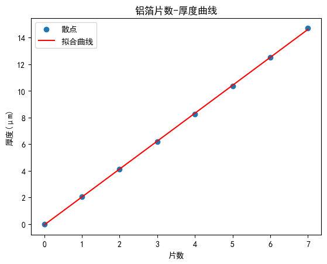

实验名称：半导体探测器与α粒子能损实验

实验人员：朱天宇

学号：202211010110

## 实验目的

1．了解α粒子通过物质时的能量损失及其规律

2．学习从能损测量求薄箔厚度的方法。

## 实验结果分析及数据处理

1．将测量的$^{241}$Am α谱以多道的道数为横坐标，以计数为纵坐标描绘在坐标纸上，算出能量分辨率。

$^{241}$Am的能谱如图

估测其全能峰的半峰宽度为11（道数），峰位是5595（道数）
因而其能量分辨率为0.20%。

2．以放射源$^{241}$Am、$^{239}$Pu等放射源的能量为横坐标，以全能峰道址为纵坐标在坐标纸上作能量和幅度校准曲线。

校准曲线为

曲线的参数与误差为
$k=1.0778\pm 0.0092 {keV}^{-1}$
$b=85.2\pm 48.7$

3．计算铝箔对于$^{241}$Am放射源α粒子的阻止能力$（dE/dx）_{平均}$及薄箔的厚度，并以铝箔层数为横坐标，厚度为纵坐标，进行线性拟合，计算铝箔的单片厚度。【注：为方便理解计算，本虚拟实验中，每种薄膜的单片厚度严格相等，在实际工作中单片厚度必然有所偏差。】
根据能谱数据，α粒子通过铝箔后的全能峰峰位、半峰宽度随箔片个数变化如下表

|铝箔个数|全能峰峰位(keV)|半峰宽度(keV)|
|---|---|---|
|0|5485.6|11.8|
|1|5164.18|22.6599|
|2|4827.91|46.6727|
|3|4475.21|73.1727|
|4|4101.17|108.209|
|5|3699.54|161.852|
|6|3263.93|237.085|
|7|2790.23|354.446|

按经验公式计算出铝的阻止截面为
$\Sigma_e=\frac{2.5*E^{0.625}*\frac{45.7}{E/1000}ln[1+\frac{0.1}{E/1000}+\frac{4.359*E}{1000}]}{2.5*E^{0.625}+\frac{45.7}{E/1000}ln[1+\frac{0.1}{E/1000}+\frac{4.359*E}{1000}]}$
铝的密度是2.7 g/cm³，摩尔质量为27 g/mol,则摩尔体积为10cm³/mol
则其组织本领为
$S=-\frac{dE}{dx}=-n*\Sigma_e=- 6.026*10^{22}*\frac{2.5*E^{0.625}*\frac{45.7}{E/1000}ln[1+\frac{0.1}{E/1000}+\frac{4.359*E}{1000}]}{2.5*E^{0.625}+\frac{45.7}{E/1000}ln[1+\frac{0.1}{E/1000}+\frac{4.359*E}{1000}]}$
计算出总厚度随箔片个数变化如下表

|铝箔个数|总厚度(μm)|
|---|---|
|0|0|
|1|2.05|
|2|4.11|
|3|6.18|
|4|8.26|
|5|10.38|
|6|12.54|
|7|14.71|

绘制成图并曲线拟合得

曲线的斜率与误差为
$k=2.098\pm0.009 \mu m$
即单层铝箔的厚度为2.098$\mu m$

4.以同样方法计算Mylar薄箔的单片厚度。

根据能谱数据，α粒子通过Mylar薄箔后的全能峰峰位、半峰宽度随箔片个数变化如下表

|薄箔个数|全能峰峰位(keV)|半峰宽度(keV)|
|---|---|---|
|0|5485.6|11.8|
|1|5194.43|23.0715|
|2|4891.11|47.083|
|3|4573.95|72.2226|
|4|4238.51|108.493|
|5|3879.09|159.528|
|6|3485.55|238.781|
|7|3062.22|357.711|

Mylar薄箔的分子式为(C10H8O4)n，密度为1.4g/cm³可计算出其阻止能力，从计算出总厚度随箔片个数变化。如下表

|Mylar箔个数|总厚度(μm)|
|---|---|
|0|0|
|1|5.63|
|2|11.28|
|3|16.94|
|4|22.66|
|5|28.48|
|6|34.46|
|7|40.44|

绘制成图并曲线拟合得

曲线的斜率与误差为
$k=5.768\pm0.029 \mu m$
即单层Mylar箔的厚度为5.768$\mu m$

## 思考题

1．试定性讨论α粒子穿过吸收体后，能谱展宽的原因。

α粒子穿过吸收体时，与电子碰撞是随机的，且多次发生，每个α粒子损失的能量不一定相同，因而形成一定的能谱展宽。

2．设组织本领为S，薄箔厚度为$\Delta X$,试计算α粒子倾斜入射，与表面法线交角为4°、6°时能量损失为多少？

我们认为，α粒子的轨迹可以近似为直线，因此与法线有夹角时，在吸收体内的移动距离会有所改变，设夹角为θ
               $\Delta X'=\frac{\Delta X}{cos\theta}$
因此能量损失：
$\Delta E=\int^{\Delta X'}_0 S dx$
若考虑组织本领S近似为常数，则：
$\Delta E=\Delta X'S= \frac{\Delta X S}{cos\theta}$
带入θ=4◦,6◦：
 $\Delta E_1 =1.0024×S\Delta X$
 $\Delta E_2 =1.0055×S\Delta X$
可以看出，角度比较小的时候，和完全垂直入射的时候相差不大。

3．探测器金层厚100A，试计算$^{241}$Am的α粒子进入灵敏区时的能量。已知金的密度为19.31$g\cdot cm^{-3}$，阻止本领dE/dx=0.228  $KeV/μg\cdot cm^{-2} $。

根据探测器的原理，α粒子需要在灵敏区中耗散掉所有的能量，因此可以得到，α粒子的能量存在一个上限，即：

$E\leq E_0=\rho \frac{dE}{dx}\Delta X=4.403KeV$

这里，将阻止本领近似成常数进行计算。这是最大可以阻止的能量，也即进入灵敏区时最大可能具有的能量。

4．从所测到的Mylar膜（C10H8O1）的能量损失，试计算其厚度。已知碳、氢、氧的原子密度分别：$N(C)=1.136\times 10^{23}atm/cm^3$、$N(H)=5.376\times 10^{19}atm/cm^3$、$N(O)=5.367\times 10^{19}atm/cm^3$ ，质量密度为:$\rho_c=2.267 g/cm^3 $、$\rho_H=8,998\times 10^{-5}g/cm^3$、$\rho_O=1.428\times 10^{-3}g/cm^3$

按化合物的公式计算出该膜的阻止能力
$[\frac{dE}{dx}]_{E_0}=\frac{1}{A_c}\sum A_iY_i(\frac{dE}{dx})_i=1.37\times 10^{6}KeV/cm$
由实验知道其损失能量为$\Delta E=E_1-E_0=291.17 KeV$,则Mylar膜厚度为
$\Delta X=\frac{1}{\frac{dE}{dx}}\Delta E=2.125\mu m$

5.从所测到的铝箔的能损，若考虑S的变化，试用（6）式计算厚度。

数据处理中均采用计算机计算（6）式积分计算出结果。