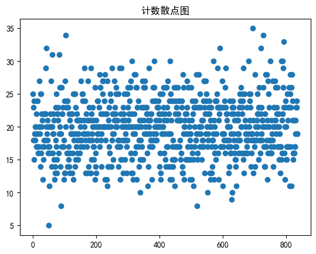
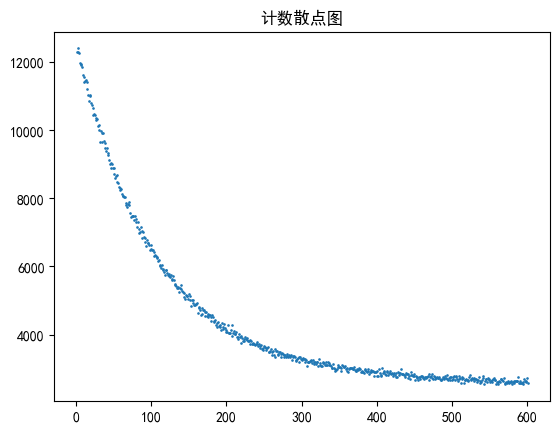
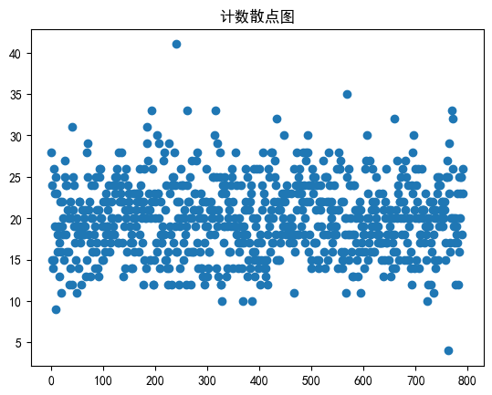
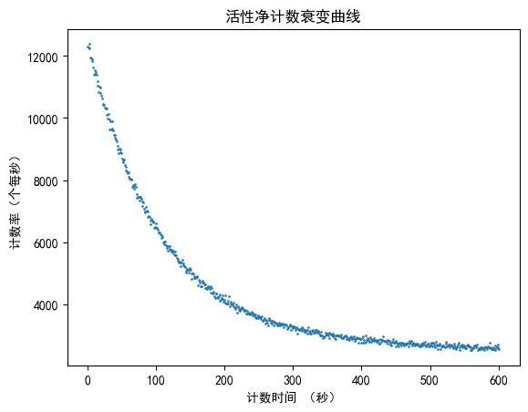
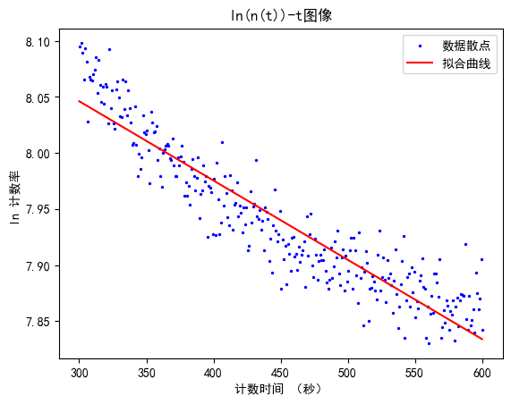
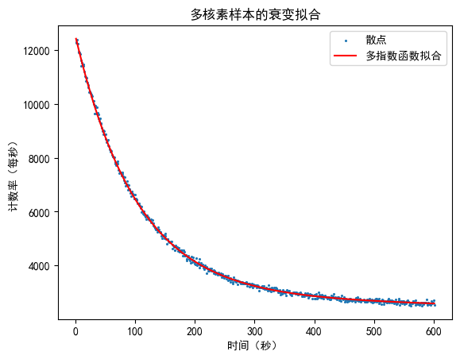

实验名称：中子活化后放射性核素半衰期测量
实验人员：朱天宇
学号：202211010110
## 实验目的
1．掌握中等寿命的放射性核素半衰期（天、时、分、秒数量级）的测定方
法。
2．了解产生人工放射性核素的基本知识。
3．学会使用多功能数字多道的多定标功能
## 实验原理
1、半衰期的测定
半衰期是放射性原子核的一条重要的基本性质，每种核素都有它特有的半衰期，因此测定半衰期和测定原子核质量一样，可以用于鉴别原子核。半衰期对研究放射性原子核有重要意义，由半衰期可以确定跃迁级次或多级性。在生产和应用放射性核素时，也需要了解其半衰期对放射性生长或衰变的关系，才能适当的掌握照射时间和不失时机的使用放射性核素。
不同放射性核素半衰期差别很大（从$10^{-11}$秒到$10^{11}$年），不同范围的半衰期测量方法各不相同。ms 以下的短半衰期用核电子学的延迟符合等方法测量。10年以上的长半衰期用比放射性的方法测量。中等半衰期则可以通过测量衰变曲线求得，本实验测量$^{116m}In$的半衰期就是这一范围的放射性核素半衰期。对于单一放射性核素，仪器得到的计数率随时间的变化为
$n(t)=n(0)e^{-\lambda t}$ 
$n(0)$(或$n_0$)为开始测量时的计数率，$n(t)$为开始测量后 $t$ 时刻的计数率，$λ$为衰变常数，
衰变常数和半衰期 $T_{1/2}$的关系为
$T_{1/2}=\frac{ln2}{\lambda}$
由计数率的指数衰变规律可得
$ln n(t)=ln n(0)-\lambda t $
计数率的对数和时间满足直线关系，用目测作图或者最小二乘法拟合直线可得$λ$，再算得 $T_{1/2}$。
由于实际上不能测到 $t$ 时刻的计数率 $n(t)$,测到的只能是某一时间间隔$Δt=t2-t1$的计数$N$，再由 $N/Δt$ 求得平均计数率$\bar n$ .
2、生产放射性核素的一般知识
将稳定核素 A 放在带电粒子或者中子流中辐照，产生核反应
$A+a\to B+b$
剩余核素 B 可能是放射性的。若剩余核素的衰变常数为$λ$，则在恒定的入射粒子通量$\phi$下，放射性核素 B 活度 A(t)按
$A(t)=\phi\sigma N_1(1-e^{-\lambda t})$
规律生长，其中$\sigma$ 是该反应的反应截面（称为活化截面），$N_1$为样品中稳定核素A的总数，$A(t)$为饱和活度，表 1 给出了产生的活度和辐照时间 t 的关系。可以根据生产核素的半衰期和辐照条件权衡确定辐照吋间。
**表1：**
|$t=nT_{1/2}$|$0.5T_{1/2}$|$1T_{1/2}$|$2T_{1/2}$|$3T_{1/2}$|$4T_{1/2}$|$5T_{1/2}$|$6T_{1/2}$|
|---|---|---|---|---|---|---|---|
|$A(t)/A(\infty)$|0.293|0.5|0.75|0.875|0.938|0.969|0.985|

天然铟的同位素丰富度及活化反应有关的数据列于表2。当被激活样品中存在两种独立的放射性核素时，衰变曲线上的计数率是两种放射性核素的计数率之和
$n(t)=n_1(t)+n_2(t)=n_1(0)e^{-\lambda_1t}+n_2(0)e^{-\lambda_2t}$
由总衰变曲线定出较长半衰期$(T_{1/2})_1$，然后从$n(t)$中扣除$n_2(t)$,求出$n_1(t)$,再得到$(T_{1/2})_2$。铟活化后生成五种放射性核素和同质异能素，由于同质异能素$^{116m}In$ 的半衰期和其他四种放射性核素半衰期相差 1-2 个数量级以上，适当选择活化辐照时间和“冷却时间”（即从停止辐照到开始测量活性的时间），可以使其它四种放射性对$^{116m}In$ 半衰期测量的影响很小，故而可以用单一放射性半衰期的规律处理数据。
**表2：**
|同位素丰度|$^{113}In4.28\% $||$^{115}In95.72\%$|||
|---|--|---|--|--|--|
|活化后剩余核素|$^{114}In$|$^{114m}In$|$^{116}In$|$^{116m}In$|$^{116}In$|
|热中子活化截面|3.9b|4.4b|45b|65b|92b|
|剩余核半衰期|71.9s|50d|14.2s|54.1min|2.16s|

## 实验内容
1.测量本底
2.根据时间道宽$Δt$ 内统计误差（与活化片的活化相关）的要求，选取每道时
间道宽$Δt$
首先 $\Delta t$要满足
       $\Delta t\lambda<<1$
即： $\Delta t<<T_{1/2}$
$T_{1/2}=54min$很容易满足
其次满足
      $0.0289\times\Delta t\times(\frac{\Delta t}{T_{1/2}})<<(t_1+t_2)/2$
其中，$t_1+t_2$取最小时$t1=0,t2=\Delta t$
则    $\Delta t << T_{1/2}/0.0578$也容易满足
本实验取$\Delta t =0.5s 、1s$
3.选择合适活化时间的源，进行测量
考虑的时间限制，我们仅对样品进行半个半衰期时间的活化。
4.测量本底

## 实验数据处理
绘图与计算均使用python

1.根据数据分别画出本底1、样本、本底2的计数散点图(x-y轴分布为计数次数、计数数量，每次计数时间为1s)

可见没有明显的过高的计数，故不删除数据
2.统计两个本底的数据，计算出本底平均计数率为
    $\bar n_b=19.94 s^{-1}$
扣除本底后，取1秒内计数作中间时间的计数率，活性净计数衰变曲线为

3.考虑到$^{116m}In$与其它同位素的半衰期，应取300s后的数据进行计算，此时，大多核素经过数个半衰期，含量已经很小。
取y轴为$ln[计数率]$，作出曲线图并拟合

得出直线斜率$k=-7.06777953\times10^{-4}$
由$lnn(t)=ln n(0)-\lambda t $ 可得
  $T_{1/2}=\frac{ln2}{\lambda}=-\frac{ln2}{k}=980.71s=16.34 min$
实际上，数据中为多种核素辐射产生的，应取拟合函数
$f(t)=A_1e^{-B_1t}+A_2e^{-B_2t}$
拟合结果为
$A_1=9566.36120\pm 29.1914443$
$B_1=9.75454995\times 10^{-3}\pm 5.77525518\times 10^{-5}$
$A_2=2898.27171\pm 33.03078$
$B_2=2.03356026\times 10^{-4}\pm 2.22689093\times 10^{-5}$

计算出半衰期为
$T_{1/2}\pm\Delta T_{1/2}=\frac{ln2}{B_2}\pm(-\frac{ln2}{B_2^2}\sigma_{B_2})=56.80\pm 6.22 (min)$

## 思考题
1.总活化时间为162.3min，冷却10min
由： $A(t)=\phi\sigma N_1(1-e^{-\lambda t})$ 计算，对同一样本，$N_1,\phi$相同,且$\sigma$ 可通过查**表2**获得

|核素|$^{116m}In(65b)$|$^{116}In$|$^{114}In$|$^{114m}In$|$^{116m}In(92b)$|
|---|---|---|---|---|---|
|A|54.44|3.34|43.07|0.026|88.06|

测量冷却时间为10min，冷却后上面$^{116m}In(92b)$、$^{114}In$、$^{116}In$等容易衰变的核素经过数个半周期含量接近零。
而$^{114m}In$经过活化后含量仅仅为0.026，远低于$^{116m}In(65b)$的54.44，此时进行测量，可认为计数率仅仅由$^{116m}In(65b)$贡献。

2.去除偏差数据；考虑本底误差；取平均降低误差；最小二乘法拟合降低误差；