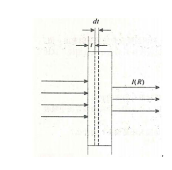
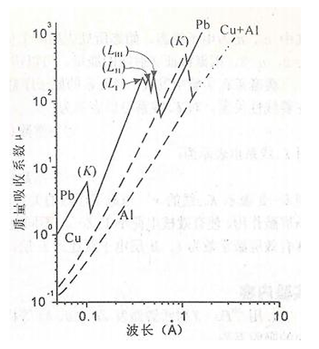
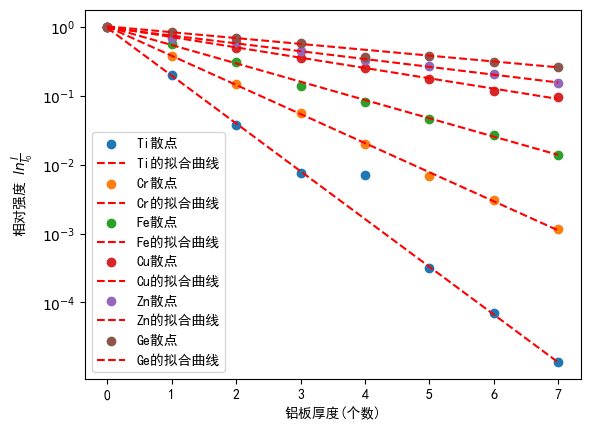
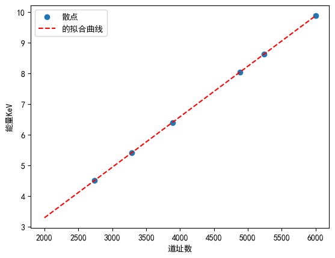
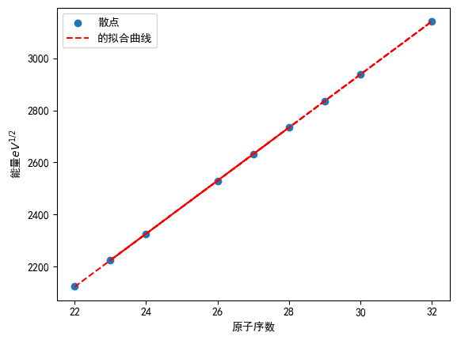

实验名称：X射线的吸收和特征谱测量

实验人员：朱天宇

学号：202211010110

## 实验目的

1.了解X射线与物质的相互作用，及其在物质中的吸收规律。
2.测量不同能量的X射线在金属铝中的吸收系数。
3.了解元素的特征X射线能量与原子序数的关系。

## 实验原理

一、X射线的吸收：X射线是一种电磁波，它的波长在100 Å到0.01 Å之间。如图1 所示，当一束单色的X射线垂直入射到吸收体上，通过吸收体后，其强度将减弱，即X射线被物质吸收。这一过程可分为吸收和散射两部分: 
1.光电吸收:入射X射线打出原子的内层电子，如K层电子，结果在K层出现一个空位，接着发生两种可能的过程:(1)当L层或高层电子迁移到K层空位上时，发出KX射线(对重元素发生几率较大);(2)放出俄歇电子(对轻元素发生几率较大)。
2.散射:散射是电磁波与原子或分子中的电子发生作用。散射也分为两种。(1)波长不改变的散射，X射线使原子中的电子发生振动，振动的电子向各方向辐射电磁波，其频率与X射线的频率相同，这种散射叫做汤姆逊散射;(2) 波长改变的散射，即康普顿散射。对于铝，当X射线的能量低于0.04MeV时光电效应占优势，康普顿散射可以忽略。

如图1所示，设一厚度及成份均匀的吸收体，其厚度为$R$，每立方厘米有$N$个原子。若能量为$h\nu$的准直光z束，单位时间内垂直入射到吸收体单位面积上的光子数为$I_0$,那么通过厚度为t的物质后，透射出去的光子数为$I(t)$并表示为:

$I(t)=I_0e^{-\mu t}$ （1）

其中，$\mu$ 为该物质对某一能量X射线的线性吸收系数，$\nu=N\cdot\sigma$，$\sigma$为截面，其单位为$cm^2/atom$，$μ$的量纲为$cm^{-1}$。对于原子序数为Z的原子，K层的光电截面为$\sigma_{ph}(cm^2/atom)$。

$\sigma_{ph}=\varphi_0Z^5\alpha^42^{5/2}\cdot(m_0c^2/h\nu)^{7/2}$（2）

其中$\varphi_0=\frac{8}{3}\pi_0r^2$ ，$r_0=e^2/m_0c^2$，$a=2\pi^2/h\approx \frac{1}{137.04}$

对于汤姆逊散射，每个电子的截面是$\sigma_T(cm^2/electron)$，

$\sigma_T=\frac{8\pi}{3}(\frac{e^2}{m_0c^2})^2=0.6652 \times 10^{-24}(cm^2/electron)$。（3）

总的线性吸收系数$\mu$为两者之和，即

$\mu=\mu_{ph}+\mu_T=N\sigma_{ph}+NZ\sigma_T$（4）

质量吸收系数为$\mu_m$

$\mu_m=\frac{\mu}{\rho}(cm^2/g)=\sigma\frac{N_A}{A}$（5）
则物质的吸收曲线可写为
$I=I_0e^{-\mu_m\rho t }$ （6）
其中中$N_A$是阿佛加德罗常数，A是原子量。图2表示了金属铅、铜、铝的质量吸收系数随波长的变化。在能量低于0.1MeV时，随着能量减小截面显示出尖锐的突变。实验表明，吸收系数突然下降的波长(吸收限)与K系激发限的波长很接近。在长波长区还有L突变与M突变存在，由于L层和M层构造的复杂性，这些突变不如K突变那样明显，并且有几个最大值。

各种元素对不同波长入射X射线的吸收系数，由实验确定。元素的质量吸收系数与入射X射线能量之间的关系，可以用经验公式表示:
对于$E'>E>E_k$

$\mu_m=C_k'\lambda^n(cm^2/g)$（7）

对于铝吸收体，$E'$为6.20keV，$E_K$为1.5596keV，$C_K'$为16.16，n为2.7345

二、X射线的特征谱：原子可以通过核衰变过程转换及轨道电子俘获，也可以通过外部射线如X射线，β射线(电子束)、α粒子或其他带电粒子与原子中电子相互作用产生内层电子空位，在电子跃迁时产生特征X射线。玻耳理论指出电子跃迁时放出的光子具有一定的波长λ，它的能量为

$h\nu=Z^2\frac{2\pi^2m_0e^4}{h^2}(\frac{1}{n_1^2}=\frac{1}{n_2^2})$（8）

其中$n_1$,$n_2$为电子终态、始态所处壳层的主量子数，对$K_α$线系，$n_1=1$,$n_2=2$，对La线系，$n_1=2$,$n_2=3$，根据特征X射线的能量，可以辨认激发原子的原子序数。
莫塞莱在实验中发现，轻元素的原子序数与$K_α$及$L_α$系特征X射线的频率$ν^{1/2}$之间存在线性关系。
$K_α$系的关系为：

$\nu^{1/2}=k(Z-1)$（9）

La线系的关系表示为：

$\nu^{1/2}=k(Z-7.4)$（10）

## 实验内容
1.用Pu-238  X射线源激发Zn、Cu、Ni等样品产生特征X射线，并测量特征X射线在铝中的吸收系数。
2.测量几种元素的特征X射线谱确定未知元素

## 实验结果与数据处理
1．测量不同能量的X射线在铝中的吸收系数。

测量得到穿过Ti、Cr、Fe、Cu、Zn、Ge金属模样品的特征X射线强度随铝片数变化如下表

|铝模片数|0|1|2|3|4|5|6|7|
|-|-|-|-|-|-|-|-|-|
|Ti（计数/秒）|9758.21|4869.44|2362.68|1168.06|1130.57|296.11|153.39|75.28|
|Cr（计数/秒）|9522.84|6256.07|4134.70|2719.06|1742.22|1094.39|769.12|504.67|
|Fe（计数/秒）|9432.75|7348.76|5699.37|4025.44|3181.88|2487.87|1952.92|1473.36|
|Cu（计数/秒）|9726.75|8486.39|7176.76|6221.71|5374.57|4592.23|3836.22|3520.29|
|Zn（计数/秒）|9535.46|8088.48|7656.66|6718.96|5912.23|5373.98|4775.85|4208.30|
|Ge（计数/秒）|9532.44|8856.92|8058.24|7563.75|6194.03|6228.10|5707.82|5335.36|

在实验条件下X光强与计数率成正比，将每个薄膜的实验数据按式（6）$I=I_0e^{-\mu_m\rho t }$ 进行拟合。
不妨取$ln(\frac{I}{I_0})$为纵轴，铝片数n为横轴，则式（6）变为
$ln(\frac{I}{I_0})=-\mu_m \rho d_0 \cdot n$ (拟合曲线时不包含偏差太大的数据点，但仍保留其散点。)
拟合结果如下图

相关拟合参数如下：
Ti:
k=-0.6933079830371238±0.003195156018835585
b=-0.01563988204931377±0.013447879915026651
Cr：
k=-0.42220298770610887±0.004175122421933651
b=0.0011149270231850528±0.017572563220239777
Fe:
k=-0.2657082334678402±0.004581170834959493
b=0.001098731000814368±0.019281352710764366
Cu:
k=-0.14969599555952917±0.003269771057735199
b=0.0011683008949863183±0.01376192949508931
Zn:
k=-0.11356318861691928±0.0032610665547200134
b=-0.013062681795116715±0.01372529009044424
Ge:
k=-0.08492634281123079±0.0016760013475842972
b=0.006650585209613813±0.0070540125286975355
铝的密度为$\rho=2.7g/cm^3$,单个铝片厚度为d_0,
则$\mu_m=-k/(\rho d_0)$
计算出各个元素的特征X射线对铝的吸收系数如下表：

|元素|Ti|Cr|Fe|Cu|Zn|Ge|
|-|-|-|-|-|-|-|
|吸收系数$\mu_m$ $( cm^3/g/d_0)$|0.257|0.156|0.0984|0.0554|0.0421|0.0314|

2.测量不同元素的特征x射线谱。
测得各个元素特征谱线的峰位如下表：

|元素|Ti|Cr|Fe|Cu|Zn|Ge|unkown1|unkown2|unkown3|
|-|-|-|-|-|-|-|-|-|-|
|峰位道址|2738.6|3286.01|3887.23|4883.56|5241.16|5999.59|3005.95|4206.13|4538.82|

查表得到已知元素的峰位能量如下

|元素|Ti|Cr|Fe|Cu|Zn|Ge|
|-|-|-|-|-|-|-|
|峰位能量KeV|4.51|5.41|6.40|8.04|8.63|9.876|

做出能谱仪的刻度曲线

参数为
k=0.0016458869865248016±3.269970184500564e-07 KeV
b=0.0022399226320478204±0.001466756879624658  KeV
将三个未知元素的峰位道址代入得到对应的峰位能量为
unkown1:4.94969 KeV 
unkown2:6.92505 KeV
unkown3:7.47262 KeV
查表得知对应的元素应该是钒V、钴Co、镍Ni
将九种元素按$(h\nu)^{1/2}=c(Z-d)$对原子系数Z进行拟合，c、d为参数。
结果如下，

c=101.88580412066169±0.07183147906384257 $eV^{\frac{1}{2}}$
d=1.1661238866889005±0.01819315478424362

显然，其接近$K_α$系的关系为：$\nu^{1/2}=k(Z-1)$
这表明我们接受到的各个元素的特征X光是由$K_α$系电子跃迁形成的。

## 思考题

1.按我们测得的数据，代入Z=47，算得Ag的特征X射线的光子能量为21.807KeV，显然大于Pu-238的ULX射线的能量，故Ag不能被激发。

2.经计算知道本实验中的截面为2-3Mb; 远大于汤姆孙散射时的截面；所以汤
姆孙散射实验在本次实验中不重要。

3.若有一定反射角度，影响实验中的t；考虑角度我们有$t=t'cos\theta$本实验中的吸收系数中计算为$\mu_m=\frac{k}{t\rho}$，k为拟合斜率，则该实验会导致测量结果偏大；即10度是实验值为真实值的1.0154倍，25度时实验值为真实值的1.1034倍。
