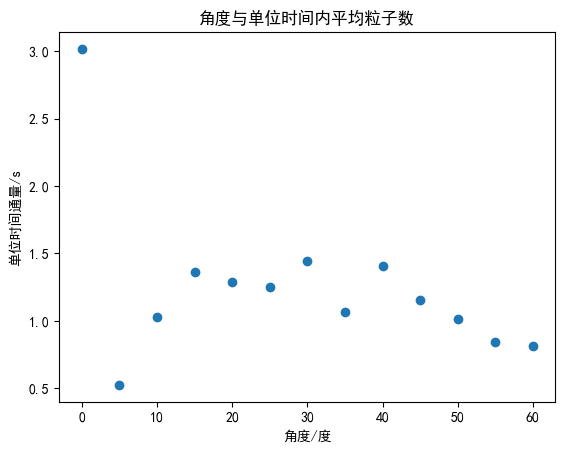

实验名称：宇宙线μ子平均寿命测量

实验人员：朱天宇

学号：202211010110

## 实验目的

1．加深宇宙线$\mu$子性质的认识;
2．掌握宇宙线$\mu$子平均寿命的测量原理;

## 实验原理

宇宙线中的$\mu$子主要是由宇宙线中的$\pi$介子衰变$(\pi^{-}\rightarrow\mu^{-}+\overline{\nu_{\mu}},\pi^{+}\rightarrow\mu^{+}+\nu_{\mu})$产生的.大部分的$\mu$子产生在约15 km的高空,由于$\mu$子不参与强相互作用,因而具有较强的穿透力.海平面上$\mu$子的通量近似为$1\sim2cm^{-2}\cdot min^{-1}$ ,平均能量约为4 GeV。$\mu$子带有1个单位的电荷,其质量为105.658 $MeV/c^2$ 平均寿命约 197.2$\mu s$。

宇宙线中的$\mu$子通过塑料闪烁体时,主要的能量损失方式是电离能损,并伴随库仑散射.高能量$\mu$子可直接从闪烁体中穿出,并在径迹周围产生电子及荧光光子等次级粒子;一些较低能量$\mu$子在闪烁体中停止后,可以自由衰变,也可能与物质的原子核发生作用被俘获而消失.其发生衰变如下:

$\mu^-\to e+\overline{V_e}+V_\mu$

衰变中产生的电子(e)继续与闪烁体发生作用损失能量,并使闪烁体分子激发,而电子反中微子$\overline{V_e}$和$V_\mu$子中微子直接穿出．塑料闪烁体中受激发的分子在极短的时间内(约$10^{-10}$s )退激发并发射荧光(荧光波长在500 ~ 350 nm之间),荧光通过光电倍增管光电转换放大而输出电信号,这个信号将作为$\mu$子的“到达”信号．当停止在闪烁体内的$\mu$子发生衰变,产生的电子被闪烁探测器探测,形成$\mu$子“衰变”的信号。“到达”探测器的信号与$\mu$子“衰变”的信号的时间间隔,即为$\mu$子1次衰变的寿命.由于微观粒子的衰变具有一定的统计性,因此实验上是通过测量时间差的分布,进而计算得到子的平均寿命。

宇宙线中$\mu$子的通量很低,每次击中探测器的事例可以看成单$\mu$子事例．设$\mu$子的平均寿命为$\tau$,第i个$\mu$子的产生时间为$t_i$,则相对公共的时间零点,$\mu$子在时刻t衰变概率为

$D_i(t)=\frac{e^{-(t-t_i)/\tau}}{\tau}$

如果第i个$\mu$子到达闪烁探测器的时刻为$T_i$,那么时间间隔$\Delta T$内,这个$\mu$子衰变的概率是:

$P=\int_{T_i}^{T_i+\Delta T}D_i(t)dt=\int_{T_i}^{T_i+\Delta T}\frac{e^{-(t-t_i)/\tau}}{\tau}dt=K-Ke^{-\Delta T/\tau}$

式中$K=e^{-(T_i-t_i)/\tau}$。如果实验共测量到M个$\mu$子衰变事例,则在时间差$\Delta T$以内,衰变的总$\mu$子数N为

$N=\sum_{i=1}^MK_i(1-e^{-\Delta T/\tau})=K(1-e^{-\Delta T/\tau})$

式中$K=\sum_{i=1}^{M}K_{i}$

可见在$\Delta T$时间内$\mu$子衰变数随时间同样服从指数规律．实验上通过记录确定时间间隔内的$\mu$子衰变事例数,利用指数函数拟合方法,可以求得$\mu$子衰变的平均寿命$\tau$。

## 实验结果与数据处理

取仪器角度为0，根据实验所测的数据，拟合可以得到寿命和相关误差如下为
$\tau=2.2341$
$\delta \tau=0.0190µs$
$\chi^2=5.8188$

探测器角度每改变5°，测量得到单位时间内平均粒子数如下表

|角度|测量时间|μ子通量数|单位时间内平均粒子数|
|--|--|--|--|
|0|680.4|2051|3.014|
|5|198.3|104|0.524|
|10|106.7|110|1.031|
|15|77.6|106|1.366|
|20|93.9|121|1.289|
|25|86.5|108|1.249|
|30|71.5|103|1.441|
|35|95.7|102|1.066|
|40|76.7|108|1.408|
|45|90.1|104|1.154|
|50|121.9|124|1.017|
|55|121.4|102|0.840|
|60|122.3|100|0.818|

将角度与单位时间内平均粒子数绘制出图

单位时间通量随角度的变化有一定的变化规律，在20-30度角的时候有
一个极大值。

## 思考题

1.实验测量μ子的寿命成概率性分布，这种概率性来源很多，主要原因是μ子本身的寿命本就是称概率分布的，这是来源量子力学的不确定性原理。
2.只需要保证射线中μ子的通量足够低就行了，比如选宇宙射线做样本源。