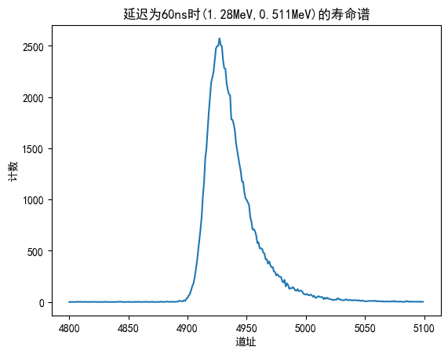

实验名称：正电子湮没寿命谱测量

实验人员：朱天宇

学号：202211010110

## 实验目的

1.了解正电子湮没寿命谱的形成原理，学会测量仪器的使用和获取正电子湮没寿命谱
2.初步掌握使用计算机解谱的数学方法和应用解谱结果来分析样品的微观结构。

## 实验原理

1928 年， Dirac 预言了正电子的存在；1932年，C.D.Anderson 证实了正电子的存在。近 20 年来，正电子湮没技术得到了迅猛的发展，在固体物理、金属物理和材料科学领域得到了广泛的应用。 正电子湮没技术可以分为寿命测量、 角关联测量和线形测量， 本实验进行的是寿命测量。

1、正电子湮没寿命
从放射源发射出的高能正电子射入物质中后，首先在极短时间内（约$10^{-12}$s以下）通过一系列非弹性碰撞减速，损失绝大部分能量至热能，这一过程称为注入与热化。热化后的最后将在物质内部与电子发生湮没。从正电子射入正电子将在样品中进行无规扩散热运动，物质到发生湮没所经历的时间一般称为正电子寿命。由于湮没是随机的， 正电子湮没寿命只能从大量湮没事件统计得出。在寿命测量中，最常用的正电子源是Na-22 放射源。当它发生 β+衰变时，主要产生动能为 0-540keV 的正电子并几乎同时发射能量为1.28MeV的γ光子，因此，可以将此γ光子的出现作为产生正电子的时间起点， 而 0.511MeV 湮没γ 光子的出现即是正电子湮没事件的终点。这段时间间隔便可以近似地看作正电子的寿命。利用时间谱仪对每个湮没事件都可以测得湮没过程所需的时间，对足够多的湮没事件（约需$10^6$ 次）进行记录，就得到了正电子湮没寿命谱。可见，所谓测量正电子湮没寿命实际上就是测量一次湮没事件中有关联的两个不同能量的 γ光子出现的时间差；将发射 1.28MeV 的 γ光子作为时间的起始信号， 而把发射 0.511MeV的 γ光子作为终止信号。

2、实验仪器
（1）LaBr3 闪烁体探测器
LaBr3 闪烁体探测器由LaBr3闪烁体及光电倍增管组成。当 γ光子射入LaBr3 闪烁体内时可发生康普顿效应，所产生的反冲电子的能量被闪烁体吸收而发生闪烁光。利用光电倍增管把微光放大并转换成电脉冲输入到相应的电子学线路中进行测量。光电倍增管由一个光阴极和多个倍增电极（通常又称为打拿极）以及阳极构成。阳极端接地，阴极端加负高压，在各打拿极上由分压电阻给出一级比一级高的电位。
（2）数字化恒比甄别器（DCFD）
是时间谱仪中决定时间分辨率的关键部件之一。光电倍增管输出脉冲的幅度和上升时间是随脉冲而有变化的，直接用它来触发一电子学线路时， 触发时刻会因此而出现抖动。为了解决这一问题，采用 DCFD 对光电倍增管的脉冲输出进行整理。它的作用是在每一阳极脉冲上升时间的一恒定点上产生一信号，使输入到时间幅度转换器的脉冲起始（或终止）时间与光电倍增管脉冲输出的起始时间之间有一恒定的时间差，不受光电倍增管输出脉冲幅度等变化的影响，而只决定于光子γ发射的时刻。这就显著地提高了测量的准确度。
（3）时幅转换器
将 DCFD 输出的起始信号与另一个 DCFD 输出的终止信号之间的时间差线性地转换为一脉冲的幅度。其测量原理如下：时间分析器相当于一个恒流源在电流开关K 的控制下对电容 C 充电；起始信号使开关 K 接通，而终止信号使 K断开。据电学基本知识，电容 C 上的电压幅度 V 与充电时间 t 的关系为
$V_c=\frac{Q}{C}=\frac{I}{C}t_x$
上式表明，由于 I 和 C 都是恒定的，输出脉冲的幅度正比于两个信号的时间差。
由于时幅转换器本身有一定的 “死时间”；当小于此时间时， 不能得到线性转换。因此，为了保证时间差信号都能得到线性转换，终止信号在输入到时间幅度转换器前先通过一延时器，其延迟时间可以按需要进行调节。 由时间分析器输出的信号可直接送入微机多道分析器（接在 ADC IN 上），由后者经过模数转换后时间差存贮在相应道址的存贮器中。利用延时器还能对时间谱仪进行时间标定。

（4）数字多道分析器
将输入脉冲按不同幅度分类计数，即不同幅度的脉冲计入不同的道址中。在多道分析器中道址与时间或能量（在本实验中为时间）相对应作为横坐标，而每道中的计数（即记录到的一定寿命的湮没事件的发生次数）作为纵坐标。这样就可以得到一个正电子湮没寿命谱。

## 数据处理及结果分析

1.选择start与stop能窗时的能谱
在选择start与stop的能窗时，我们用到的一个能谱，这个能谱是直接使用闪烁体探测器输出的脉冲形成的能谱，它峰位的道址直接与γ光的能量有关。实验时，这个能谱一致在累加计数，我们取最后的数据画出能谱如下

图中有两个规则的峰，道址分别为2000左右与5000左右，道址低的一个自然是0.511MeV的光子形成的峰，而道址低的是1.28MeV 的光子形成的峰。

2.寿命谱
取30ns为延迟时间，start与stop的能窗分别取(0.511MeV,1.28MeV)、(1.28MeV,0.511MeV)、(0.511MeV,0.511MeV)时的寿命谱如下

先分析(0.511MeV,0.511MeV)的寿命谱，如图四，其峰位与半峰宽分别为2457.74，50.1332。其曲线是一个对称分布的曲线。这是因为恒比甄别器接受脉冲是有统计性的，来源于样品中正电子湮灭与闪烁体探测器中闪烁光产生的不确定性，这种大量随机造成的结果是接近于正态分布的，故形成的寿命谱是对称的，即关于30ns延迟形成的脉冲峰位对称。

然后分析(0.511MeV,1.28MeV)的寿命谱，如图二，其峰位与半峰宽分别为2444.49，33.6。其曲线并不对称，而是向峰位高的方向偏离。这是因为，两个恒比甄别器选择了不同的触发能窗，而由于1.28MeV的光子产生时间早与0.511MeV光子产生的时间，如果选0.511MeV作为start能窗，这就相当于在设定30ns延迟基础的上，附加了负的时间延迟，总的延迟变小，输出脉冲的峰位变小。

而(1.28MeV,0.511MeV)时的寿命谱是相反的情况。其峰位与半峰宽分别为2472.76，33.3466。

2.计算各寿命组分的寿命值和相对相对强度和协方差矩阵
为时幅转换器定标，测量延时为60ns时(1.28MeV,0.511MeV)的寿命谱，如下

其峰位与半峰宽为4927，30.3。

与30ns时的数据对比，我们可以得到道址与时间的对应关系为，0.0122ns/道址。

在延迟取30ns时，30ns延迟产生脉冲峰的峰位为(4927-2472.76)/30*30=2454.24，与(1.28MeV,0.511MeV)的峰位比较，偏差为2472.76-2454.24=18.52道址，对应的时间为0.2264ns，我们可以认为，这个时间近似是正电子在样本中湮灭所需的时间，即正电子湮灭寿命。

实际上，由于正电子在物质中的湮灭是多种形式，我们测得寿命谱应该是一种复合谱，我们可以将其分解为几部分。在一般情况下，对于偏离中心峰位的部分，我们可以使用多个指数函数的和进行拟合[**1**]，每个指数函数称为一个组分，有自己对应的湮灭寿命。
$f(t_1)=\sum\limits_K a_K e^{-\frac{t_1}{\tau_K}}$
其中，$t_1=t-T_0$，$t_1>>\frac{\sigma^2}{2\tau_K}$
利用定标将寿命谱中的道址转化为时间，取两个组分，对满足指数近似成立范围内的数据进行拟合，得到结果如下。

各组分的参数如下
a_1=5129.57±27.54
t_1=0.2409±0.001 ns
a_2=6.3267±3.1659
t_2=2.3673±1.0849 ns
各组的寿命分别为0.241ns和2.367ns，
相对相对强度分别为99.88%和0.22%

3.查资料得，金属中正电子自由态湮没的典型寿命值为170ps 。我们所测得时间为226.4ps 。如果要分析实验样品的微观结构变异情况，我们发现0.511MeV谱线的出现也延后了。如果我们取0.511MeV谱线为30ns延迟的峰位，则可计算出湮灭寿命为183.4ps，与典型值更加接近.

## 思考题

1.Na-22 放射源强度太弱，测量效率低，需要等很久才有足够多的计数降低误差；容易与环境混淆，对甄别器精度要求高。Na-22放射源强度太强会损伤样品。

2.恒比甄别器会判断光子能量并进行筛选，如果设置在相应能窗的下阈以上，那么对应的能量就会与环境噪声一同被过滤，不能通过甄别器。从而不被记录失掉湮没事件。

[**1**]薛嘉渔，正电子湮没寿命谱的多指数函数拟合方法，核技术，6，1983