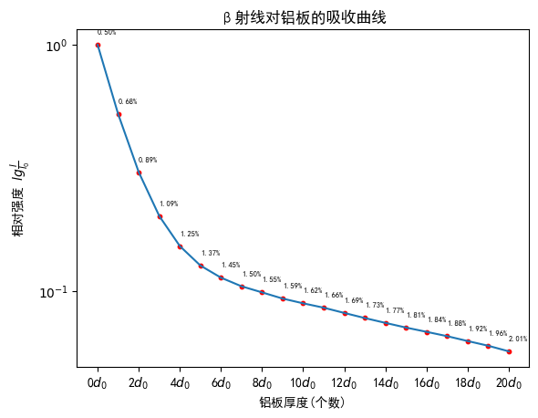
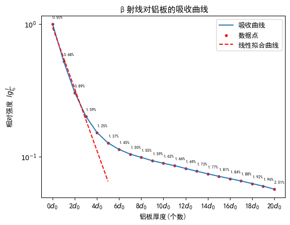

实验名称：β射线的吸收

实验人员：朱天宇

学号：202211010110

## 实验目的

1、了解β射线在物质中的吸收规律。
2、利用吸收系数法和最大射程法，确定β射线的最大能量，并鉴别放射性核素。

## 实验原理

测定射线的能量是鉴別放射性核素的一种常用方法。$\beta$射线能量的测量可用$\beta$吸收法或利用各种$\beta$谱仪直接測量 $\beta$ 谱。本实验介绍一种最为简单的方法——吸收法，即通过测定 $\beta$ 粒子在吸收物质中的吸收系数或最大射程，然后换算出能量。此法求得能量的不确定性低于5%,目前在核燃料后处理、保健物理及污染分析等工作中有着广泛的应用。原子核在发生衰变时，放出的粒子其强度随能量变化为一条从零开始到最大能量 $E_{\beta max}$ 的连续分布曲线。一般来说，核素的不同，其最大能量 $E_{\beta max}$ 不同，因此，测定$\beta$射线的最大能量便提供了一种鉴別放射性核素的依据。一束$\beta$射线通过吸收物质时，其强度随吸收层厚度増加而逐渐减弱的现象叫做$\beta$吸收。对大多数$\beta$谱，吸收曲线的开始部分在半对数坐标纸上是一条直线，这表明它近似地服从指数衰减规律。

$\frac{I}{I_0}=e^{-\mu_md_m}$,其中$\mu_m$为物质的质量吸收系数，$d_m$为质量厚度

连续$\beta$谱的吸收曲线是许多单能电子吸收曲线的叠加；同时，$\beta$射线穿过吸收物质时，受到原子核的多次散射，运动方向有很大改变，因此无确定的射程可言，亦不能如同单能$\alpha$粒子的吸收那样，用平均射程来反映粒子的能量。确定$\beta$射线最大能量的方法，常用的有以下两种：

一、吸收系数法
实验证明，不同的吸收物质，$\mu_m$随物质的原子序数Z的增加而缓慢増加。对一定的吸收物质，$\mu_m$还与 $E_{\beta max}$有关。对于铝有下面的经验公式
$\mu_m=\frac{17}{ E_{\beta max}^{1.14}}$，其中$\mu_m$的单位取$cm^2/g$, $E_{\beta max}$的单位为MeV.
二、最大射程法。
一般用$\beta$射线在吸收物质中的最大射程$R_\beta$来代表它在该物质中的射程。因此全吸收厚度就代表$R_\beta$。通过$R_\beta$与 $E_{\beta max}$的经验公式或曲线即得到 $E_{\beta max}$。经验证明，在铝中的$R_\beta$(g/cm^2)和 $E_{\beta max}$(MeV)的关系如下：

当 $E_{\beta max}$>0.8MeV时，$E_{\beta max}=1.85R_\beta+0.245$

当 $0.15MeV<E_{\beta max}$<0.8MeV时，$E_{\beta max}=1.92R_\beta^{0.725}$

当 $E_{\beta max}$<0.2MeV时，$R_\beta=0.685E_{\beta max}^{1.67}$

在这种方法中，$E_{\beta max}$的不确定性与$R_\beta$和射程——能量关系式的准确程度有关。实际测量中，常把计数率降到原始计数率（无吸收）万分之一处的吸收厚度作为$R_\beta$。在测量吸收曲线时，$\beta$射线和轫致辐射干扰能够使得在吸收厚度超过$R_\beta$后仍有较高的计数。
## 实验结果与数据处理

1．在半对数坐标纸上画出吸收曲线，计算并标出各实验点的相对误差。

根据实验测定的数据，要求误差小于2%，故去除单次计数小于2500的通道的数据。本底射线的强度（计数率）为：49.83 计数/秒。$\alpha$射线的强度以及穿过各个铝板后的强度如下表：

|铝板个数|0|1|2|3|4|5|6|7|8|9|10|
|---|-|-|-|-|-|-|-|-|-|-|-|
|计数率(计数/秒)|11652.630|6117.335|3577.815|2389.621|1816.609|1522.838|1365.184|1263.21|1195.879|1131.615|1084.473|
|**续表**|**11**|**12**|**13**|**14**|**15**|**16**|**17**|**18**|**19**|**20**|
|--------|1043.08|995.5294|951.4133|911.6598|874.8266|842.5933|811.1026|777.2444|745.8831|710.44|

去除本底强度后，将计数数据取对数lg，绘制出吸收曲线

2．利用吸收曲线上近似直线部分的实验点，进行直线拟合确定$μ_m$并计算出$E_{βmax}$

考虑到铝板厚度小时，部分低能的$\beta$粒子也能穿过，应取吸收曲线的后半部分，又考虑到接近最大射程后有轫致辐射干扰，取$0d_0-3d_0$的数据点进行拟合

得到参数k及其误差为$k=-(0.232\pm0.016) (/个数)$

注：由于我们以铝板个数而非厚度进行拟合，并且取10为底数，得到的参数k实际是吸收系数乘以单个铝板质量厚度$\rho d_0=0.02 g/cm^2$以及系数$lg(e)$的参数$lg(e)\mu \rho d_0$,计算能量为

$E_{\beta max}=(\frac{17}{ \mu_m})^{1/1.14}=(\frac{17}{ k/lg(e)/d_0\rho})^{1/1.14}$=0.5583 Mev= 558.3 keV

3.用直接外推法，求出$R_β$，并计算$E_{\beta max}$。

按照直接外推法，求出相对强度降低到百分之一的厚度，从2中的拟合图像可知y=k*x+b，当y=10^{-2}时，$x=(-2-b)/k=7.7067$,乘以单片的质量厚度$\rho d_0=0.02 g/cm^2$，得到$R_{\beta}=0.154 g/cm^2$，从2知$E_{\beta max}$应在0.15-0.8$Mev$左右，套用公式$E_{\beta max}=1.92R_\beta^{0.725}=0.4949 Mev$
比较知待测源为Cs−137，查资料知其最大β衰变的能量为0.512MeV 。相对误差为3.34%。

## 思考题

1.内转换常在重原子的最内几个电子壳层中发生，发射γ射线，其能量较高；β射线一般会取代外层电子，能量较低。

2.α射线的穿透能力差，在空气中的射程只有1～2厘米；β射线穿透本领较强。α粒子是带正电的重粒子，在空气中极易电离，也容易与其他粒子碰撞，所以速度降低得很快，穿透能力差。

3.取$E_{\beta max}=0.765 MeV$,代入经验公式求出$R_{\beta}=0.2810 g/cm^2$,不能，不同元素的电子排布不同，致密程度也不同，测出来的经验曲线也不同，经验公式也不同。

4.粒子被散射后，所测得粒子数减少，测得吸收系数增大。可以选择原子核比较小的元素充当吸收片从而减少散射的影响。

5.采用较薄的吸收片，依此增加吸收片的数量，直到吸收曲线明显不成直线。因为这样测出来比较精确，单吸收偏数量要多，多次测量导致时间过长。

6.吸收系数法直接通过$\mu_m$求出最大能量，需要对曲线斜率进行拟合，但总体来说比较方便。直接外推法，有三段拟合公式，拟合较为精准，但是外推的过程误差很大。

