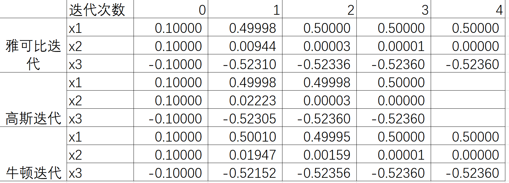

# 实验报告
202211010110 朱天宇
使用三种迭代方法数值求解非线性方程组，代码见附件HM1.m。下面是迭代法的公式推导。
原方程组为
$$\begin{cases}
3x_1-\cos(x_2x_3)-\frac{1}{2}=0 \\
x_1^2-81(x_2+0.1)^2+\sin x_3+1.06=0 \\
\exp(-x_1x_2)+20x_3+\frac{(10\pi-3)}{3}=0 & 
\end{cases}$$
经过简单变形，
$$\begin{cases}
x_1=\frac{1}{3}\cos(x_2x_3)+\frac{1}{6} \\
x_2=\frac{1}{9}(x_1^2+\sin x_3+1.06)^{\frac{1}{2}}-0.1 \\
x_3=-\exp(-x_1x_2)/20-\frac{(10\pi-3)}{60} & 
\end{cases}$$
可以用以雅可比迭代法与高斯迭代法。
若使用牛顿迭代法，对于原方程
$$\begin{cases}F_1(\bold X)=0 \\F_2(\bold X)=0 \\F_3(\bold X)=0 \end{cases}$$
不妨将每个$F$在$\bold X=\bold  a$处做泰勒展开，
$$\begin{cases}F_1(\bold X)=F_1(\bold a)+\nabla F_1(\bold a)\cdot (\bold X-\bold a)\\F_2(\bold X)=F_2(\bold a)+\nabla F_2(\bold a) \cdot(\bold X-\bold a) \\F_3(\bold X)=F_3(\bold a)+\nabla F_3(\bold a) \cdot(\bold X-\bold a) \end{cases}$$
在求$\bold F=0$ 时，我们认为$F(\bold X)=0$,所以上式写成矩阵形式为
$$\bold J(\bold a)(\bold X-\bold a)=F(\bold a) $$
其中，$F(\bold a)=\begin{pmatrix} F_1(\bold a)\\ F_2(\bold a)\\ F_3(\bold a)\end{pmatrix}$，$\bold J(\bold a)$为$ F(\bold a)$在$\bold X=\bold  a$处的雅可比矩阵。
这个形式就是牛顿迭代法的迭代公式。

设定初始值为[0.1 0.1 -0.1],收敛精度为1e-5，使用matlab计算，比较三种方法的迭代速度，下面分别为雅可比迭代、高斯迭代、牛顿迭代每次的迭代结果。

可以发现，高斯迭代法是最快的只用了3次迭代，而雅可比与牛顿的速度一样。这是因为，每次迭代时，高斯迭代使用了本次迭代中的结果，使得后计算的变量的值快速收敛从而减少整体的迭代次数，这是普通迭代所不具备的。