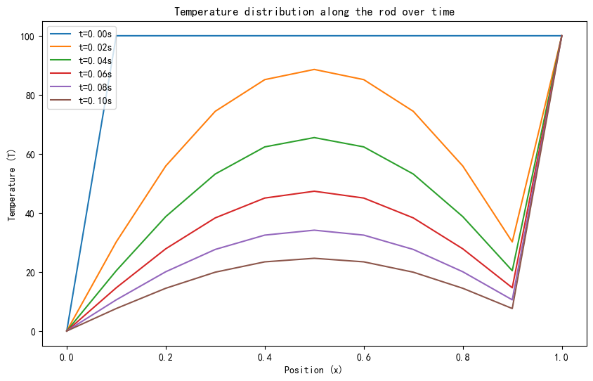

# 实验报告
202211010110 朱天宇
使用Crank-Nicolson求解偏微分方程，代码见附件[Hw3.py](Hw3.py)。下面是推导过程与最终结果图。

## 过程推导
**热传导方程**
\[
\frac{\partial T}{\partial t}=\kappa\frac{\partial^2 T}{\partial x^2}
\]
其中，\(T\)是温度，\(t\)是时间，\(x\)是空间坐标，\(\kappa\)是热扩散系数。
**离散化空间和时间**

• 空间离散化：将空间区间\([0,1]\)等分为\(N\)个节点，每个节点之间的距离为\(\Delta x=\frac{1}{N}\)。
• 时间离散化：将时间区间\([0,0.1]\)等分为\(M\)个时间步，每个时间步长为\(\Delta t=\frac{0.1}{M}\)。


考虑Crank-Nicolson方法，即在时间上使用中心差分，在空间上使用二阶中心差分。对于热传导方程，我们有：

\[
\frac{T_i^{n+1}-T_i^n}{\Delta t}=\frac{\kappa}{2}\left(\frac{T{i+1}^{n+1}-2T_i^{n+1}+T{i-1}^{n+1}}{(\Delta x)^2}+\frac{T{i+1}^n-2T_i^n+T{i-1}^n}{(\Delta x)^2}\right)
\]

其中，\(T_i^n\)表示在时间\(n\Delta t\)时，空间位置\(i\Delta x\)处的温度。


**简化方程**

将上述方程重写为：

\[
-\frac{\kappa\Delta t}{2(\Delta x)^2}T{i-1}^{n+1}+\left(1+\frac{\kappa\Delta t}{(\Delta x)^2}\right)T_i^{n+1}-\frac{\kappa\Delta t}{2(\Delta x)^2}T{i+1}^{n+1}=\frac{\kappa\Delta t}{2(\Delta x)^2}T{i-1}^n+\left(1-\frac{\kappa\Delta t}{(\Delta x)^2}\right)T_i^n+\frac{\kappa\Delta t}{2(\Delta x)^2}T{i+1}^n
\]


**线性方程组**

对于每个时间步\(n\)，我们得到一个线性方程组，其中包含\(N-2\)个未知数\(T_i^{n+1}\)（\(i=1,2,...,N-1\)，因为边界条件已经给出）。这个方程组可以表示为矩阵形式\(A\mathbf{T}^{n+1}=\mathbf{b}^n\)，其中：


• \(A\)是一个三对角矩阵，其对角线元素为\(1+\frac{2\kappa\Delta t}{(\Delta x)^2}\)，次对角线和超对角线元素为\(-\frac{\kappa\Delta t}{(\Delta x)^2}\)。

• \(\mathbf{T}^{n+1}\)是一个包含\(T_i^{n+1}\)的向量。

• \(\mathbf{b}^n\)是一个由已知温度值构成的向量。


**边界条件**


• \(T_0^{n+1}=0\)（左边界条件）

• \(T_N^{n+1}=100\)（右边界条件）


**初始条件**

• \(T_i^0=0\)对于所有\(i\)（初始时刻整个杆的温度为0度）


**数值求解**

在每个时间步\(n\)，我们需要求解上述线性方程组来得到\(\mathbf{T}^{n+1}\)。我们可以通过直接求解或迭代方法完成，如高斯消元法、LU分解或共轭梯度法等。本次使用numpy提供的线性方程求解函数solve完成。


## 代码实现

使用Python编程实现了上述过程。代码如下：


```python
import numpy as np
import matplotlib.pyplot as plt

# 参数设置
L = 1.0       # 杆的长度
T = 0.1       # 总时间
Nx = 10       # 空间步数
Nt = 100      # 时间步数
alpha = 0.835 # 热扩散系数

# 计算空间和时间步长
dx = L / Nx
dt = T / Nt

# 稳定性条件
r = alpha * dt / (dx ** 2)
assert r < 0.5, "稳定性条件不满足，请减小时间步长dt或空间步长dx"

# 初始化温度分布
x = np.linspace(0, L, Nx+1)
T = np.zeros((Nt+1, Nx+1))
T[0, :] = 100 * np.ones(Nx+1)  # 初始温度分布

# 边界条件
T[:, 0] = 0
T[:, -1] = 100

# Crank-Nicolson方法
A = (1 + 2*r) * np.eye(Nx-1) - r * np.eye(Nx-1, k=-1) - r * np.eye(Nx-1, k=1)
B = (1 - 2*r) * np.eye(Nx-1) + r * np.eye(Nx-1, k=-1) + r * np.eye(Nx-1, k=1)

for n in range(0, Nt):
    T[n+1, 1:-1] = np.linalg.solve(A, np.dot(B, T[n, 1:-1]))

# 绘制结果
plt.figure(figsize=(10, 6))
for n in range(0, Nt+1, Nt//5):
    plt.plot(x, T[n, :], label=f't={n*dt:.2f}s')
plt.xlabel('Position (x)')
plt.ylabel('Temperature (T)')
plt.title('Temperature distribution along the rod over time')
plt.legend()
plt.show()
```


## 结果与讨论



运行结果如图所示。图中展示了在不同时间点（\(t=0.005s,0.02s,0.04s,0.06s,0.08s,0.10s\)）的温度分布。可以观察到，随着时间的推移，温度逐渐从两端向中间扩散，最终趋于稳定。


**结果分析**


• 在初始时刻，温度分布呈现线性变化，中间温度较低。

• 随着时间的增加，温度分布逐渐趋于平缓，中间温度升高。

• 在\(t=0.10s\)时，温度分布接近最终稳定状态，两端温度较高，中间温度较低。


**讨论**


• Crank-Nicolson方法在模拟热传导过程中表现出良好的稳定性和精度。

• 通过调整空间步数和时间步数，可以进一步提高模拟的精度。

• 本研究中使用的参数设置（如空间步数和时间步数）可以根据实际需求进行调整。


