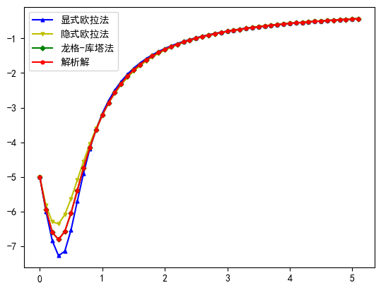
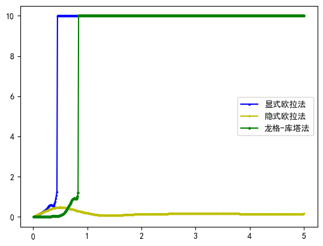

# 实验报告
202211010110 朱天宇
使用隐式欧拉法求解常微分方程初值问题，代码见附件[Hw2.py](Hw2.py)。下面是迭代式的推导与结果对比。
## 理论推导
原微分方程为$\frac{dy}{dx}=xy^2+2y$,初值条件为$y(0)=-5$.
这是一个伯努利微分方程。
其**解析解**为
$$\sqrt{\left(2\,x-1\right)\,y+4}=\dfrac{C\,\sqrt{y}}{{e}^{x}}$$
代入初值条件可得，
$$y=\frac{-4}{\frac{9}{5}e^{-2x}+2x-1}$$

根据**显式欧拉法**，迭代式为$y_{k+1}=y_{k}+hf(x_k,y_k)$
其中，$f(x_k,y_k)=x_ky_k^2+2y_k$，则，
$$y_{k+1}=y_{k}+h(x_ky_k^2+2y_k)$$
通过这个迭代式，我们可以从初值出发求出任意点的数值解。

根据**隐式欧拉法**，迭代式为$y_k=y_{k-1}+hf(x_k,y_k)$
其中，$x_k=x_{k-1}+h,f(x_k,y_k)=x_ky_k^2+2y_k$，则，
$$y_k=y_{k-1}+h[(x_{k-1}+h)y_k^2+2y_k]$$
即：$$y_k^2+\frac{2h-1}{h(x_{k-1}+h)}y_k+\frac{1}{h(x_{k-1}+h)}y_{k-1}=0$$
这个迭代式为非线性方程，可以利用牛顿迭代法求解（实际上一元二次方程能够准确求解）。
根据牛顿迭代公式$x_{j+1}=x_j-\frac{f(x_j)}{f'(x_j)}$，则求解$y_k$的
迭代式应为，
$$y_{j+1}=y_j-\frac{y_j^2+\frac{2h-1}{h(x_{k-1}+h)}y_j+\frac{1}{h(x_{k-1}+h)}y_{k-1}}{2y_j+\frac{2h-1}{h(x_{k-1}+h)}}$$
经过n次迭代$(j=1,2,...,n)$，可以求出$y_k$。
如此，我们得到了从$y_{k-1}$求$y_k$的一般过程。规定好步长$h$，重复上述过程，可以求出原微分方程在任意区间上的数值解。

根据**四阶龙格-库塔公式**，迭代式为
$$y_{k+1}=y_k+h(k_1+2k_2+2k_3+k_4)/6$$
其中，$k_1=f(x_k.y_k),k_2=f(x_k+h/2,y_k+hk_1/2),k_3=f(x_k+h/2,y_k+hk_2/2),k_4=f(x_k+h,y_k+hk_3)$，
同理根据初值可得出任意区间上的数值解。

## 结果对比及误差与步长的关系
使用python语法，将上述四个解求出，以步长$h=0.1$为例，

很直观的发现，显式法的偏差最大，隐式法其次，龙格-库塔法最小。
取步长$h=[0.01,0.02,...,5]$,把每个解的方差算出来并绘图如下：

很直观的看出，在随着步长的增大，三种方法的误差都在变大，若认为
均方差大于10为收敛标准，可以发现显式欧拉法与龙格-库塔法在步长分别大于0.45,0.84的时候，均方差就会大于10。而对于隐式欧拉法，可以发现，其误差随步长增长的十分缓慢，表现出较好的稳定性。注对于步长大于1时，误差变小的原因是在区间(0,5)内步长越大数据点越少，故步长超过一定程度时，均方差变小。

**总结：** 在步长较小的情况下，龙格-库塔法的误差最小，精确度高，而两种欧拉法的误差范围实际是十分接近的。在步长较大时，显式欧拉法与龙格-库塔法会出现不收敛的情况，从而出现较大误差，而隐式欧拉法在较大的步长下也能保持较小的误差，稳定性更好。