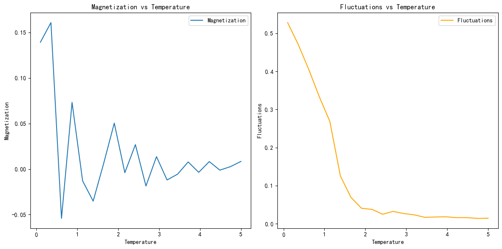

# 实验报告
202211010110 朱天宇
通过蒙特卡洛模拟方法研究二维伊辛模型的临界行为，计算并分析体系的磁化强度和序参量涨落随温度的变化。代码见附件[Hw5.py](Hw5.py)。

## 理论背景

二维伊辛模型是一个描述铁磁材料中原子磁矩相互作用的统计物理模型。其哈密顿量定义为：
\[H=-J\sum{\langle i,j\rangle}s_i s_j\]
其中，\(s_i\)为第\(i\)个格点上的自旋，取值为\(\pm 1\)，\(J\)为交换常数，\(\langle i,j\rangle\)表示对所有最近邻格点对求和。

昂萨格的精确解给出了二维伊辛模型的临界温度：
\[k_B T_c=\frac{2J}{\ln(1+\sqrt{2})}\]
对于\(J=1\)的情况，临界温度约为\(T_c\approx 2.269\)。

## 实验方法

蒙特卡洛模拟

• 初始化自旋配置：在一个\(N\times N\)的格点上随机初始化自旋。

• Metropolis 算法：在每个温度下，使用 Metropolis 算法更新自旋配置，直到达到热平衡。

• 计算磁化强度和序参量涨落：在热平衡后，计算磁化强度和序参量涨落。

## 实验结果

实验结果如图所示，展示了磁化强度和序参量涨落随温度的变化。

## 结果分析

• 磁化强度：在较低温度下，磁化强度较高，表明体系处于铁磁相。随着温度的升高，磁化强度逐渐减小，表明体系趋向于顺磁相。这与理论预期相符。

• 序参量涨落：在较低温度下，涨落较大，表明体系中的自旋状态变化较大。随着温度的升高，涨落逐渐减小，这与理论预期相符。

• 临界温度：从图中可以看出，磁化强度在\(T\approx 2.2\)附近开始显著减小，这与理论预测的临界温度\(T_c\approx 2.269\)相符。

## 结论

通过蒙特卡洛模拟，我们成功地研究了二维伊辛模型的临界行为。实验结果与理论预期相符，验证了昂萨格的精确解。此外，通过计算序参量涨落，我们进一步理解了体系在临界点附近的行为。本实验展示了蒙特卡洛模拟方法在研究统计物理模型中的有效性。