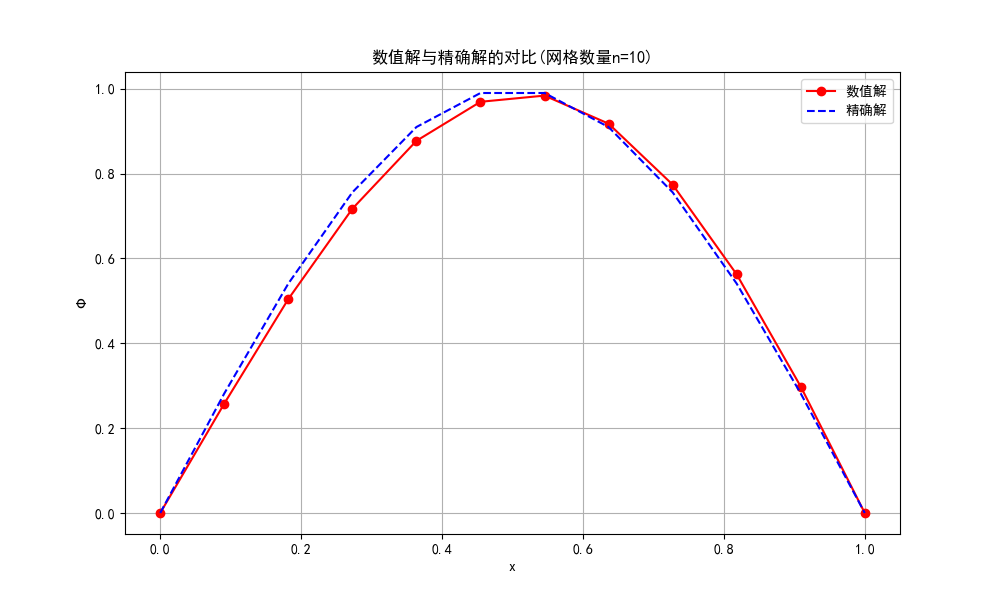
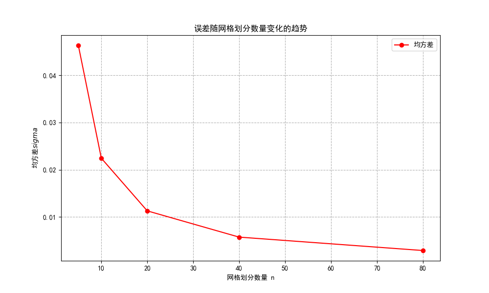
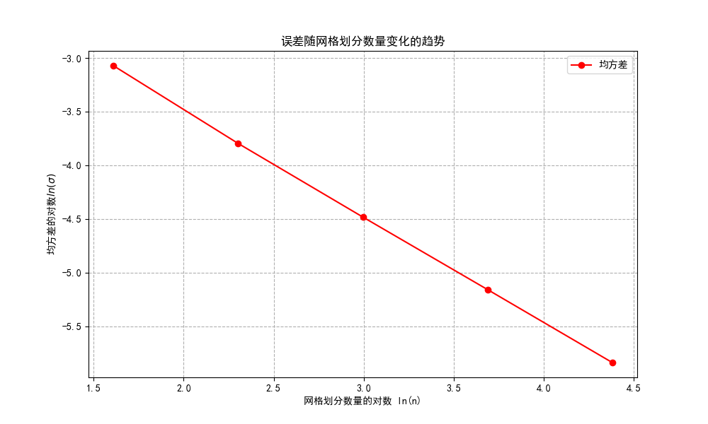

# 实验报告
202211010110 朱天宇
使用Galerkin方法求解一维泊松方程，代码见附件[Hw4.py](Hw4.py)。下面是推导过程与最终结果图。
## 问题重述
考虑一维泊松方程：
\[
\frac{d^2\phi}{dx^2}=-4\pi\rho(x)
\]
其中\(\rho(x)=0.25\pi\sin(\pi x)\)，边界条件为\(\phi(0)=\phi(1)=0\)。
## 推导过程
1.弱形式

首先，我们将泊松方程转化为弱形式。将方程两边乘以一个测试函数\(v(x)\)并在区间\([0,1]\)上积分：
\[
\int_0^1\frac{d^2\phi}{dx^2}v(x)\,dx=-4\pi\int_0^1\rho(x)v(x)\,dx
\]

通过分部积分，得到：
\[
-\int_0^1\frac{d\phi}{dx}\frac{d v}{dx}\,dx+\left[\frac{d\phi}{dx}v(x)\right]_0^1=-4\pi\int_0^1\rho(x)v(x)\,dx
\]

由于\(\phi(0)=\phi(1)=0\)，边界项消失，得到：
\[
\int_0^1\frac{d\phi}{dx}\frac{d v}{dx}\,dx=4\pi\int_0^1\rho(x)v(x)\,dx
\]

2.有限元近似

将区间\([0,1]\)分成\(n+1\)个相等的区间，区间间隔\(h=1/(n+1)\)。选择基函数\(u_i(x)\)如图中所示：
\[
u_i(x)=
\begin{cases}
\frac{x-x_{i-1}}{h},&x_{i-1}\leq x\leq x_i\\
\frac{x_{i+1}-x}{h},&x_i\leq x\leq x_{i+1}\\
0,&\text{其他}
\end{cases}
\]

近似解为：
\[
\phi_n(x)=\sum_{i=1}^n a_i u_i(x)
\]

3.Galerkin方法

将\(\phi_n(x)\)代入弱形式，选择\(v(x)=\phi_n(x)\)，得到：
\[
\int_0^1\frac{d\phi_n}{dx}\frac{d\phi_n}{dx}\,dx=4\pi\int_0^1\rho(x)\phi_n(x)\,dx
\]

根据线性代数理论，这问题可以等价写成矩阵形式：
\[
\mathbf{A}\mathbf{a}=\mathbf{d}
\]

其中：
\[
A_{ij}=\int_0^1\frac{d u_i}{dx}\frac{d u_j}{dx}\,dx
\]
\[
d_k=4\pi\int_0^1\rho(x)u_k(x)\,dx
\]

系统矩阵性质：

• 对称性：由于\(A_{ij}=A_{ji}\)，矩阵\(\mathbf{A}\)是对称的。

• 正定性：对于所有非零向量\(\mathbf{a}\)，有\(\mathbf{a}^T\mathbf{A}\mathbf{a}>0\)，因此\(\mathbf{A}\)是正定的。

## 结果展示与误差分析

当取网格数n=10时，数值求解出的解与精确解的图如下：

可以看出，即使较少的网格数，数值解与精确解也十分接近，说明格林法的效果不错。

若取网格数量n = [5, 10, 20, 40, 80],求出精确解后再计算均方差，误差随网格数量的变化如下：

可以发现，网格数量越多，误差越小，且误差与网格数量的关系接近指数关系，对误差取指数，再作图，呈明显的线性关系。
